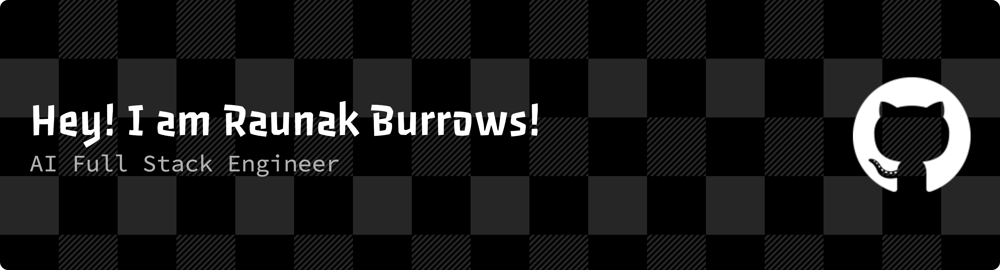

<div align="center">




<p align="center">
  <!-- LinkedIn -->
  <a href="https://linkedin.com/in/raunak-burrows">
    <picture>
      <source media="(prefers-color-scheme: dark)" srcset="https://readmecodegen.vercel.app/api/social-icon?name=linkedin&size=60&theme=dark" />
      
    </picture>
  </a>&nbsp;&nbsp;

  <!-- GitHub -->
  <a href="https://github.com/burrows99">
    <picture>
      <source media="(prefers-color-scheme: dark)" srcset="https://readmecodegen.vercel.app/api/social-icon?name=github&size=60&theme=dark" />
      
    </picture>
  </a>&nbsp;&nbsp;

  <!-- LeetCode -->
  <a href="https://leetcode.com/u/raunakburrows/">
    <picture>
      <source media="(prefers-color-scheme: dark)" srcset="https://readmecodegen.vercel.app/api/social-icon?name=leetcode&size=60&theme=dark" />
      
    </picture>
  </a>&nbsp;&nbsp;

  <!-- X (Twitter) -->
  <a href="https://x.com/burrows_raunak">
    <picture>
      <source media="(prefers-color-scheme: dark)" srcset="https://readmecodegen.vercel.app/api/social-icon?name=twitter&size=60&theme=dark" />
      
    </picture>
  </a>&nbsp;&nbsp;

  <!-- Instagram -->
  <a href="https://instagram.com/burrows___">
    <picture>
      <source media="(prefers-color-scheme: dark)" srcset="https://readmecodegen.vercel.app/api/social-icon?name=instagram&size=60&theme=dark" />
      
    </picture>
  </a>
</p>


London, UK &nbsp;&nbsp;&nbsp; | &nbsp;&nbsp;&nbsp; 📞 UK: [+44 7442 124987](tel:+447442124987) &nbsp;&nbsp;&nbsp; | &nbsp;&nbsp;&nbsp; 📞 IN: [+91 8219 486037](tel:+918219486037) &nbsp;&nbsp;&nbsp; | &nbsp;&nbsp;&nbsp; 📧 raunakburrows@gmail.com

</div>

---

<!-- About Me -->
<p align="center">
  
</p>


```csharp
My Profile ver. 5.0.1:
----------------------------------------------------------------------------------------
Username: Raunak Burrows
WhoamI: Full-Stack / AI Software Engineer. MSc Artificial Intelligence student.
Shell: zsh
Editor: VS Code / Neovim
Pronouns: He/Him
Location: United Kingdom
Languages: Python, JavaScript, TypeScript, Java
Hobbyes: Backend systems, AI tooling, automation
Learning: Advanced LLM systems, Mixture-of-Agents, scalable architectures
Special.Interests:
LLM tooling · RAG pipelines · Agent systems · Cloud-native backends
FavouriteSong: Depends on the day — usually jazz, blues, or hip-hop
FavouriteEquation: Euler’s formula (also respects Schrödinger’s equation)
Hobbies: Gaming · Chess · Coding with music on · Piano · Guitar · Drums · Sketching
Open.Source:
GitHub: burrows99
Current.Role: Freelance AI Software Engineer @ Aixolotl (Stealth Startup)
Education: MSc Artificial Intelligence — University of Surrey (UK), Feb 2026


```

---

<p align="center">
  
</p>


| [](https://git.io/typing-svg) | [](https://git.io/typing-svg) |
|------------------------|---------------------|
| <p align="center"><strong>Languages</strong><br><br>Java · Python · TypeScript · JavaScript</p><br><p align="center"><strong>AI / LLM & Agent Systems</strong><br><br>Ollama · LangChain · LangFlow · LangGraph · LlamaIndex · FAISS<br>MCP Servers · OpenAI API · Hugging Face · LLM Fine-tuning</p><br><p align="center"><strong>Backend</strong><br><br>Spring Boot · Node.js · Express · NestJS · FastAPI</p> | <p align="center"><strong>Frontend</strong><br><br>React · Next.js · Redux · HTML · CSS · Sass · Tailwind</p><br><p align="center"><strong>Databases & ORM</strong><br><br>PostgreSQL · MySQL · MongoDB · Prisma</p><br><p align="center"><strong>Cloud, DevOps & Tooling</strong><br><br>AWS · Docker · Vercel · Git · GitHub · Bitbucket · Postman · Figma</p> |

---

<!-- Stats -->
<p align="center">
  
</p>

<br>

<div align="center">
  
  
  
</div>

<hr>

<!-- Experience Highlights -->
<p align="center">
  
</p>


```csharp
My Experience ver. 5.0.4:
----------------------------------------------------------------------------------------
Aixolotl — Freelance AI Software Engineer (Oct 2025 – Present):
Building generative UI dashboards and integrating third-party MCP servers into scalable AI pipelines for production-grade systems.

Sciometrix (US) — Software Engineer FTE (Jul 2023 – Jun 2025):
Automated workflows, built HIPAA-compliant EDI and RAG systems, replaced third-party medical APIs → ~$1.4k/month savings, 60% efficiency gain, 30–40% accuracy boost.

Turing — Data Scientist (Fixed Term) (Jun 2024 – Jun 2025):
Performed supervised fine-tuning and RLHF on Grok LLM for the X platform, improving response relevance by ~25%.

TheKindCitizen — Founding Engineer (Jan 2025 – Present):
Built Next.js event booking platform (https://thekindcitizen.com), designed backend, orchestrated LLM pipelines, and developed custom agent tooling.

QuestionPro Pvt. Ltd. — Full Stack Developer FTE (Aug 2022 – Jul 2023):
Shipped analytics dashboards and core APIs, fixed 50+ UI/UX issues, improved Lighthouse scores by 20%, reduced tickets by 45%, and raised NPS by +0.8.

Infosys Ltd. — Specialist Programmer FTE (Sep 2021 – Aug 2022):
Built Kotlin + Spring Boot microservices for eBay, halved service latency, led Docker CI/CD, and mentored junior devs to 90% test coverage.
```

---

<!-- Contributions -->
<p align="center">
  
</p>

<div align="center">
  <picture>
    <source media="(prefers-color-scheme: dark)" srcset="https://raw.githubusercontent.com/burrows99/burrows99/output/github-contribution-grid-snake-dark.svg" />
    <source media="(prefers-color-scheme: light)" srcset="https://raw.githubusercontent.com/burrows99/burrows99/output/github-contribution-grid-snake.svg" />
    
  </picture>
</div>


```csharp
// Selected Projects & Open-Source Work
// ------------------------------------------------------------

- 🤖 Open-Source MCP Automation
  Built a browser automation stack using LibreChat + Playwright-MCP,
  with a Node.js bridge and Docker-ready setup.
  Links:
    - LinkedIn: https://www.linkedin.com/feed/update/urn:li:activity:7356798113082224642/
    - GitHub:   https://github.com/burrows99/LibreChat

- 🌌 3D Solar System (Three.js)
  Interactive 3D solar system simulation built with Three.js.
  Links:
    - Live: https://solar-system-engine.onrender.com/
    - Code: https://github.com/burrows99/solar_system

- 🎥 Sentiment Analysis of Movie Reviews
  Backend service for sentiment classification of movie reviews.
  Links:
    - Github: https://github.com/burrows99/elastiq-backend
    - Live: https://elastiq-backend.onrender.com/

- 🦠 Simulating Bacterial Infections in Python
  Open-source contribution implementing a Python-based infection
  simulation, accompanied by a published technical article.
  Link:
    - Article: https://www.linkedin.com/pulse/simulating-bacterial-infections-python-my-experience-surrey-burrows-xsuwf/
```
<hr>

---

<!-- Education -->
<p align="center">
  
</p>

| [](https://git.io/typing-svg) | [](https://git.io/typing-svg) | [](https://git.io/typing-svg) |
|---------------------------------|---------------------------|---------------------------------------------------------------------------------------------------------------------------------------------------------------------------------------------------------------------------------------------------------------------------------------------------------------------------------------------------------------------------------------------------------------------------------------------------------------------------------------------------------------------------------------------------------------------------------------------------------------------------------------------------------------- |
| **[University of Surrey](https://www.surrey.ac.uk/)**, Guildford, UK                     | MSc Artificial Intelligence<br>Feb 2025 – Feb 2026             | - Ranked **#270 globally** in QS World University Rankings by Subject: Engineering & Technology 2025 ([QS Source](https://www.topuniversities.com/university-subject-rankings/engineering-technology?search=University%20of%20Surrey))<br>- Dissertation: *Efficient Collaborative Synthesis in LLMs: A Mixture-of-Agents Approach*<br>- Supervisor: Dr. Xiatian Zhu, Senior Lecturer, People-Centred AI<br>- Developed MoA framework improving LLM factual grounding by \~30%, full-stack prototype built (React + Node.js) |
| **[Jaypee University of Information Technology](https://www.juit.ac.in/)**, Solan, India | B.Tech Computer Science & Engineering<br>July 2017 – June 2021 | - NAAC A+ Accredited ([NAAC A+ Accredited)](https://www.juit.ac.in/rankings-and-recognitions))<br>- Ranked **#179 in QS Asia University Rankings 2025**: Southern Asia ([QS Source](https://www.juit.ac.in/rankings-and-recognitions))<br>- Ranked **801–1000 in World University Rankings 2025** by Times Higher Education ([THE Source](https://www.juit.ac.in/rankings-and-recognitions))<br>- Capstone Projects:<br>    - [Reflex Test (85%)](https://github.com/burrows99/reflex-test)<br>    - [Jarvis-AI (80%)](https://github.com/burrows99/jarvis-ai) (Project report available on request)                                                            |


---


<!-- Academic Highlights -->
<p align="center">
  
</p>


```csharp
My Academics ver. 5.0.2:
----------------------------------------------------------------------------------------
MSc Artificial Intelligence — University of Surrey (2025)
Dissertation: "Optimising NHS Waiting Time Systems using Mixture of Agents (MoA)"
- Awarded Distinction
- Commended for clarity of writing, people-centred design, strong system architecture, first-class simulation results
- Recognised for applying LLM-driven AI in NHS triage routing under privacy constraints

12th CBSE — 85.4% (Equivalent to UK A-Levels AAAA)
Subjects: Mathematics 88%, Physics 89%, Chemistry 81%, Computer Science 81%, English 88%
Marksheet: https://drive.google.com/file/d/1P5O4wUi1EOmlxBjI9EyUuRhPeSHD_7ZY/view

10th CBSE — 8.0 CGPA (Equivalent to UK GCSEs, grades A/A⁺)
Core Subjects: Mathematics, Science, English, Computer Science
Marksheet: https://drive.google.com/file/d/1Er4Xx8Kq_pB38X3aZjh5Nc9xO2nprPGs/view
```
