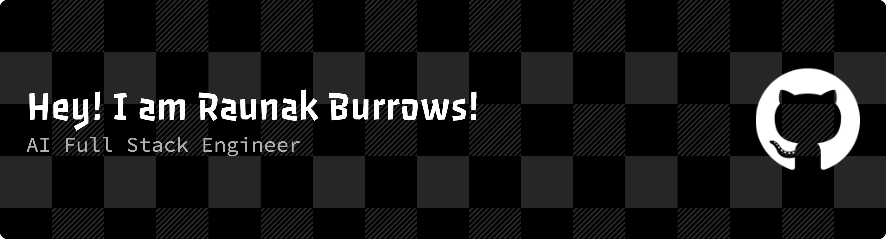

<!-- ═══════════════════════════════════════════════════════════════ -->
<!-- HERO: Banner + Typing SVG + Social Badges                     -->
<!-- ═══════════════════════════════════════════════════════════════ -->

<picture>
  <source media="(prefers-color-scheme: dark)" srcset="./github-header-banner.png">
  <source media="(prefers-color-scheme: light)" srcset="./github-header-banner.png">
  
</picture>

 

 

  &nbsp;
  &nbsp;
  &nbsp;
  &nbsp;
  &nbsp;
  

 

---

<!-- ═══════════════════════════════════════════════════════════════ -->
<!-- ABOUT ME                                                       -->
<!-- ═══════════════════════════════════════════════════════════════ -->

## 👨‍💻 About Me

<table>
<tr>

<!-- Left: Profile Image -->
<td width="30%" align="center" valign="center">
  
</td>

<!-- Right: Info cards -->
<td width="70%" valign="top">

 &nbsp; Hi, I'm **Raunak** — a Full-Stack / AI Software Engineer based in London.

 &nbsp; **Location:** &nbsp; 
 
 &nbsp; **Role:** &nbsp; 
 
 &nbsp; **Education:** &nbsp; 
 
 &nbsp; **Languages:** &nbsp;     
 
 &nbsp; **Interests:** &nbsp;    
 
 &nbsp; **When AFK:** &nbsp;      

</td>

</tr>
</table>

---

<!-- ═══════════════════════════════════════════════════════════════ -->
<!-- CURRENTLY WORKING ON                                           -->
<!-- ═══════════════════════════════════════════════════════════════ -->

## 🔭 What I'm Building

<table>
<tr>

<!-- Card 1 -->
<td width="50%" valign="top">

  
    
  
   
  <b>AI Engineer · Switzerland (Remote)</b>

 

Production AI platform (AIxChat) orchestrating multi-step LLM pipelines via MCP with tenant-boundary enforcement, deployed to Azure.

 

`Python` `Node.js` `MCP` `Docker` `Azure`

 

  

</td>

<!-- Card 2 -->
<td width="50%" valign="top">

  
    
  
   
  <b>Founding Engineer</b>

 

Highly-concurrent events booking platform with secure ticket locking and RBAC for 1,000+ simultaneous users.

 

`Next.js` `Node.js` `Vercel` `PostgreSQL`

 

  

</td>

</tr>
</table>

---

<!-- ═══════════════════════════════════════════════════════════════ -->
<!-- LANGUAGES & TOOLS                                              -->
<!-- ═══════════════════════════════════════════════════════════════ -->

## 🛠️ Languages & Tools

| **Languages** | **AI / LLM & Agents** | **Backend** |
|:---:|:---:|:---:|
|  |  |  |
| Python · TypeScript · Go · JavaScript · Java | LangGraph · LangChain · LlamaIndex · FAISS · MCP Servers · Ollama · OpenAI · HuggingFace · PyTorch | Go (Gin) · Node.js · Express · NestJS · FastAPI |

| **Frontend** | **Databases** | **Cloud & DevOps** |
|:---:|:---:|:---:|
|  |  |  |
| React · Next.js · Redux · Tailwind | PostgreSQL · MySQL · MongoDB | AWS · Docker · Kubernetes · Vercel · Git · GitHub Actions · CI/CD |

---

<!-- ═══════════════════════════════════════════════════════════════ -->
<!-- FEATURED PROJECTS                                              -->
<!-- ═══════════════════════════════════════════════════════════════ -->

## 📌 Featured Projects

| Project | Description | Links |
|---------|-------------|-------|
| 🤖 **MCP Automation** | Browser automation with LibreChat + Playwright-MCP, Node.js bridge, Docker-ready | [Code](https://github.com/burrows99/LibreChat) · [Post](https://www.linkedin.com/feed/update/urn:li:activity:7356798113082224642/) |
| 🌌 **3D Solar System** | Interactive Three.js solar system simulation | [Live](https://solar-system-engine.onrender.com/) · [Code](https://github.com/burrows99/solar_system) |
| 🎬 **Sentiment Analysis** | Movie review sentiment classification backend | [Live](https://elastiq-backend.onrender.com/) · [Code](https://github.com/burrows99/elastiq-backend) |
| 🦠 **Bacterial Infections Sim** | Python-based infection simulation + published article | [Article](https://www.linkedin.com/pulse/simulating-bacterial-infections-python-my-experience-surrey-burrows-xsuwf/) |

---

<!-- ═══════════════════════════════════════════════════════════════ -->
<!-- GITHUB STATS                                                   -->
<!-- ═══════════════════════════════════════════════════════════════ -->

## 📊 GitHub Stats

  
  
   
  

---

<!-- ═══════════════════════════════════════════════════════════════ -->
<!-- EXPERIENCE                                                     -->
<!-- ═══════════════════════════════════════════════════════════════ -->

## 💼 Experience

<!-- ──── Timeline ──── -->
<table>

<!-- ╔══ 1 · LEFT ══╗ -->
<tr>
<td width="47%" align="right" valign="top">

**AI Engineer**
 📍 Switzerland (Remote) &nbsp;·&nbsp; 🗓️ Oct 2025 – Feb 2026

Architected and shipped AIxChat — a production AI platform orchestrating multi-step LLM pipelines via MCP with tenant-boundary enforcement, deployed to Azure.

`Python` `Node.js` `MCP` `Docker` `Azure`

</td>
<td width="6%" align="center" valign="top">
    
</td>
<td width="47%">&nbsp;</td>
</tr>

<!-- ╔══ 2 · RIGHT ══╗ -->
<tr>
<td width="47%">&nbsp;</td>
<td width="6%" align="center" valign="top">
    
</td>
<td width="47%" align="left" valign="top">

**Founding Engineer**
 📍 India (Remote) &nbsp;·&nbsp; 🗓️ Jan 2024 – Mar 2024

Architected and launched a highly-concurrent events booking platform with secure ticket locking, RBAC, and fault-tolerant workflows for 1,000+ simultaneous users.

`Next.js` `Node.js` `Vercel` `PostgreSQL`

</td>
</tr>

<!-- ╔══ 3 · LEFT ══╗ -->
<tr>
<td width="47%" align="right" valign="top">

**Data Scientist**
 📍 Remote (US) &nbsp;·&nbsp; 🗓️ Jun 2024 – Jun 2025

Performed supervised fine-tuning and RLHF on Grok LLM for the X platform, improving response relevance by ~25%.

`Python` `RLHF` `LLM Fine-tuning` `Grok`

</td>
<td width="6%" align="center" valign="top">
    
</td>
<td width="47%">&nbsp;</td>
</tr>

<!-- ╔══ 4 · RIGHT ══╗ -->
<tr>
<td width="47%">&nbsp;</td>
<td width="6%" align="center" valign="top">
    
</td>
<td width="47%" align="left" valign="top">

**Software Engineer**
 📍 Michigan, US (Remote) &nbsp;·&nbsp; 🗓️ Jul 2023 – Apr 2025

Owned full ADLC for enterprise validation agent via MCP. Built HIPAA-compliant X12 EDI engine in Go → ~$1.4k/mo savings, ~30% fewer claim errors. Shipped RAG chatbot with 40% relevance boost.

`Python` `Go` `FastAPI` `RAG` `AWS` `HIPAA`

</td>
</tr>

<!-- ╔══ 5 · LEFT ══╗ -->
<tr>
<td width="47%" align="right" valign="top">

**Full Stack Developer**
 📍 Pune, India (Remote) &nbsp;·&nbsp; 🗓️ Aug 2022 – Jul 2023

Engineered FastAPI microservices for LLM-based text summarisation (Genie AI product). Built Go (Gin) analytics APIs raising NPS from 3.8→4.6/5 across 1M+ MAU fleet.

`Python` `Go` `FastAPI` `Node.js` `React`

</td>
<td width="6%" align="center" valign="top">
    
</td>
<td width="47%">&nbsp;</td>
</tr>

<!-- ╔══ 6 · RIGHT ══╗ -->
<tr>
<td width="47%">&nbsp;</td>
<td width="6%" align="center" valign="top">
    
</td>
<td width="47%" align="left" valign="top">

**Specialist Programmer**
 📍 Bangalore, India (Remote) &nbsp;·&nbsp; 🗓️ Sep 2021 – Aug 2022

Architected high-performance Go microservices for eBay's retail platform — 2× throughput, latency 4→2 ms. Owned 'eBay Bagging Service' end-to-end, 99.9% uptime. Raised test coverage 65%→90%.

`Go` `Gin` `Docker` `GitHub Actions` `eBay`

</td>
</tr>

</table>

  � All roles shown in reverse chronological order

---

<!-- ═══════════════════════════════════════════════════════════════ -->
<!-- EDUCATION                                                      -->
<!-- ═══════════════════════════════════════════════════════════════ -->

## 🎓 Education

| Degree | Institution | Highlights |
|--------|-------------|------------|
| **MSc Artificial Intelligence** (Distinction) | [University of Surrey](https://www.surrey.ac.uk/), UK · 2025–2026 | Dissertation: *Optimising NHS Waiting Times using MoA* · Reduced doctor wait times by 58%, boosted resource utilisation by 19% |
| **B.Tech Computer Science** | [JUIT](https://www.juit.ac.in/), India · 2017–2021 | NAAC A+ Accredited · Capstone: [Reflex Test](https://github.com/burrows99/reflex-test) · [Jarvis-AI](https://github.com/burrows99/jarvis-ai) |

---

<!-- ═══════════════════════════════════════════════════════════════ -->
<!-- CONTRIBUTION SNAKE                                             -->
<!-- ═══════════════════════════════════════════════════════════════ -->

## 🐍 Contributions

  <picture>
    <source media="(prefers-color-scheme: dark)" srcset="https://raw.githubusercontent.com/burrows99/burrows99/output/github-contribution-grid-snake-dark.svg" />
    <source media="(prefers-color-scheme: light)" srcset="https://raw.githubusercontent.com/burrows99/burrows99/output/github-contribution-grid-snake.svg" />
    
  </picture>

