

<table>
<tr>
<td width="27%" align="center" valign="top">

</td>
<td width="73%" valign="top">

**AI and agent engineer in London.** I build agentic systems that ship to production: multi-agent orchestration, MCP servers, and the eval pipelines that keep them honest, in Go, Python and TypeScript.

- 🔭 &nbsp;Currently a tech lead in an **AI Products & Platform** team
- 🌍 &nbsp;**79 merged open-source PRs** across Windmill, Kubernetes Kueue, Hugging Face Transformers, NVIDIA CUDA-Q, Meta's Metro, tRPC, n8n, Google ADK and more
- 🧭 &nbsp;**5+ years in production**: clinical AI orchestration, LLM evals for Grok, MCP agents over HIPAA claims, Go microservices for eBay
- 🌱 &nbsp;**MSc AI, University of Surrey (Merit)**: my dissertation cut NHS doctor wait times by 58% with a Mixture-of-Agents
- 💬 &nbsp;Ask me about **agents, MCP servers, evals or Go microservices**
- 🎹 &nbsp;Off-keyboard: chess, piano, guitar, drums, and a sketchbook
- 📫 &nbsp;Reach me at **raunakburrows@gmail.com**

</td>
</tr>
</table>

  &nbsp;
  &nbsp;
  &nbsp;
  &nbsp;
  

---

### 💼 Experience

<!-- experience:start (generated by scripts/build_experience.py) -->

<a href="https://www.linkedin.com/in/raunak-burrows/" title="Career Gantt chart, newest first: Vice President, AI Products &amp; Platforms, Citi (Nov 2026–now, AI platforms · VP); Senior Engineer, Hesta Health (Apr 2026–Oct 2026, PHI-safe LLM); AI Engineer, Aixolotl (Oct 2025–Sep 2026, MCP · Azure); Data Scientist, Turing (Jun 2024–Aug 2024, +25% relevance); Software Engineer, Sciometrix (Jul 2023–Apr 2025, −65% overhead); Full Stack Developer, QuestionPro (Aug 2022–Jul 2023, NPS 3.8→4.6); Specialist Programmer, Infosys (Sep 2021–Aug 2022, 2× throughput)"></a>

Roles and highlights

| Role | Highlight |
|---|---|
| **Vice President, AI Products & Platforms** [Citi](https://www.citigroup.com/)&nbsp;·&nbsp;2026–now | Building AI-powered products, backend services and internal developer platforms for the bank's engineers in the **AI Product & Platform** team of Citi's **Chief Technology Office** (**Go**, **Kubernetes**, LLM-powered applications) |
| **Senior&nbsp;Engineer** [Hesta&nbsp;Health](https://hesta.health/)&nbsp;·&nbsp;2026 | Built the clinical AI orchestration service (Python/FastAPI, LangGraph) for a postnatal care platform: parallel DAG execution, per-run model routing, and PHI de-identified with Microsoft Presidio before any payload reaches a Claude model |
| **AI&nbsp;Engineer** [Aixolotl](https://aixolotl.com/)&nbsp;·&nbsp;2025–26 | Architected and shipped **AIxChat** from zero to one: a production AI platform orchestrating multi-step LLM pipelines via MCP, with tenant-boundary enforcement, deployed to Azure |
| **Data&nbsp;Scientist** [Turing](https://www.turing.com/)&nbsp;·&nbsp;2024 | Eval-driven pipelines (SFT, RLHF, LLM-as-a-Judge, golden datasets) for the [Grok LLM](https://grok.com/) on X, improving response relevance by **25%** |
| **Software&nbsp;Engineer** [Sciometrix](https://www.sciometrix.com/)&nbsp;·&nbsp;2023–25 | An MCP validation agent with 12 tools over HIPAA-regulated claims, cutting validation overhead by **~65%** and raising claim accuracy by **~35%**; a Go X12 EDI engine saving **~$1,400/month** |
| **Full&nbsp;Stack&nbsp;Developer** [QuestionPro](https://www.questionpro.com/)&nbsp;·&nbsp;2022–23 | FastAPI LLM microservices shipped as [Genie AI](https://www.questionpro.com/help/genie-overview.html); post-launch NPS rose from **3.8→4.6/5** |
| **Specialist&nbsp;Programmer** [Infosys](https://www.infosys.com/)&nbsp;·&nbsp;2021–22 | Go microservices for eBay's retail platform: **2× throughput**, latency cut from **4→2 ms** with pprof profiling |

<!-- experience:end -->

---

### 🌍 Open source

I have [**79 merged pull requests**](https://github.com/search?type=pullrequests&q=is%3Apr+author%3Aburrows99+is%3Amerged+-user%3Aburrows99+-org%3Ahestahealth+-org%3Amacquery-labs+-repo%3Akarammm%2Fmacquery+-repo%3Apesto-students%2Fp11-mohammad-burrows99) across 26 projects in agent, workflow and ML infrastructure. Most of them are bug fixes; Windmill's founder merged 30 of my 33 Windmill PRs, four of them features.

<!-- oss-wall:start (generated by scripts/build_oss_wall.py) -->

<b>✅ 79 merged · 26 projects</b> <a href="https://github.com/search?type=pullrequests&q=is%3Apr+author%3Aburrows99+is%3Amerged+-user%3Aburrows99+-org%3Ahestahealth+-org%3Amacquery-labs+-repo%3Akarammm%2Fmacquery+-repo%3Apesto-students%2Fp11-mohammad-burrows99">all merged PRs</a>

<a href="https://github.com/n8n-io/n8n/pulls?q=is%3Apr+author%3Aburrows99+is%3Amerged" title="n8n — 2 merged: Discord node keeps the original error; singular stop-executions toast">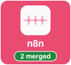</a>

<a href="https://github.com/trpc/trpc/pulls?q=is%3Apr+author%3Aburrows99+is%3Amerged" title="tRPC — 2 merged: OpenAPI: null in nullable literal-union enums, redundant union members dropped">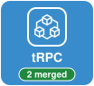</a>

<b>🟡 50 in review · 🕰️ 2 earlier</b> 
<a href="https://github.com/meta/lexical/pulls?q=is%3Apr+author%3Aburrows99+is%3Aopen" title="Lexical — in review: Meta: font-size input, roving-toolbar keys, floating toolbar after a block drag (all 4 approved)">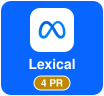</a>

<a href="https://github.com/mantinedev/mantine/pulls?q=is%3Apr+author%3Aburrows99+is%3Aopen" title="Mantine — in review: TagsInput splitChars literal; MultiSelect keeps disabled values on Backspace (both verified)">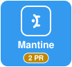</a>
<a href="https://github.com/LiteSVM/litesvm/pulls?q=is%3Apr+author%3Aburrows99+is%3Aopen" title="LiteSVM — in review: failed durable-nonce transactions advance the nonce; drained fee payers removed">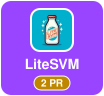</a>

<!-- oss-wall:end -->

Full list with highlights

<table align="center">
<tr><th>Project</th><th>Merged</th><th>Highlights</th></tr>
<tr><td colspan="3" align="center"><b>🆕 Recent: merged in Nov 2026</b></td></tr>
<tr>
<td align="center"><a href="https://github.com/windmill-labs/windmill/pulls?q=is%3Apr+author%3Aburrows99+is%3Amerged">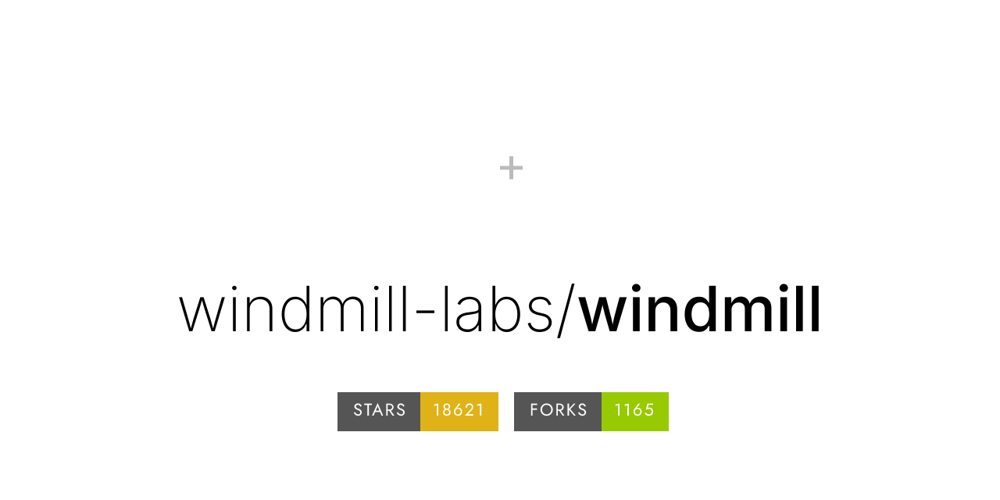</a></td>
<td align="center">33</td>
<td><a href="https://github.com/windmill-labs/windmill/pull/12450">Folder write-permission prefix bug</a> · <a href="https://github.com/windmill-labs/windmill/pull/12453">UTF-8 webhook GET payloads</a> · <a href="https://github.com/windmill-labs/windmill/pull/12466">Clearing a variable's value</a> · features: <a href="https://github.com/windmill-labs/windmill/pull/12515">argument descriptions from JSDoc and Python docstrings</a>, <a href="https://github.com/windmill-labs/windmill/pull/12513">Python client retries on 429 and 502–504</a>, <a href="https://github.com/windmill-labs/windmill/pull/12512">resource usage count per resource type</a> · <a href="https://github.com/windmill-labs/windmill/pull/12584">Date &amp; Time input valid again once a later day is picked</a> · <a href="https://github.com/windmill-labs/windmill/pull/12581">Changed default value applies to the Time and Date Select components</a> · <a href="https://github.com/windmill-labs/windmill/pull/12582">Filter value suggestions match by label, in any case</a></td>
</tr>
<tr>
<td align="center"><a href="https://github.com/kubernetes-sigs/kueue/pulls?q=is%3Apr+author%3Aburrows99+is%3Amerged">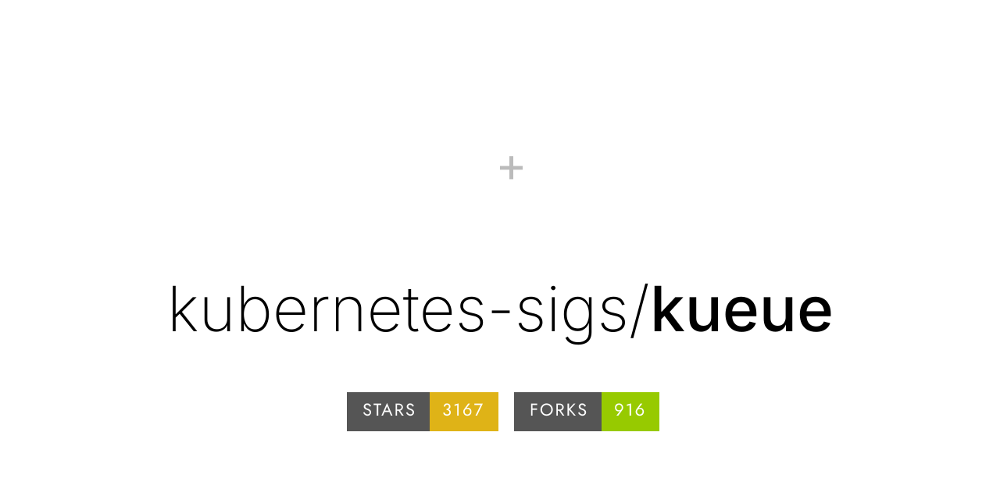</a></td>
<td align="center">5</td>
<td><a href="https://github.com/kubernetes-sigs/kueue/pull/18977">ResourceFlavor that fits the Pod in the Pod importer</a> · <a href="https://github.com/kubernetes-sigs/kueue/pull/18803">Truncated names ending in a dot</a>, backported to <a href="https://github.com/kubernetes-sigs/kueue/pull/18959">release-0.20</a> and <a href="https://github.com/kubernetes-sigs/kueue/pull/18960">0.19</a> at a maintainer's request</td>
</tr>
<tr>
<td align="center"></td>
<td align="center">4</td>
<td><a href="https://github.com/huggingface/transformers/pull/50816">Multimodal pipelines return the chat as <code>input_text</code></a> · <a href="https://github.com/huggingface/transformers/pull/50817">Docs imports that failed on main</a></td>
</tr>
<tr>
<td align="center"><a href="https://github.com/llm-d/llm-d-inference-sim/pulls?q=is%3Apr+author%3Aburrows99+is%3Amerged">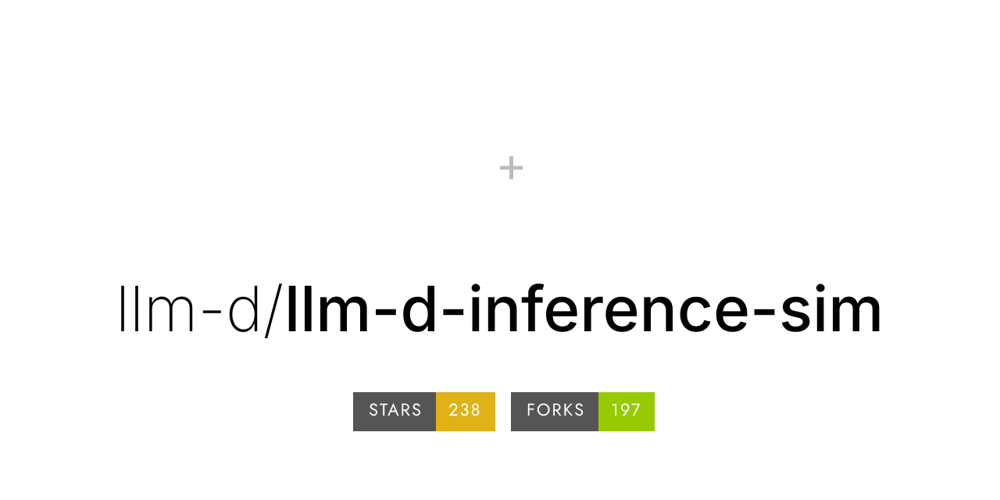</a></td>
<td align="center">4</td>
<td><a href="https://github.com/llm-d/llm-d-inference-sim/pull/917">Streamed <code>/v1/responses</code> event numbering</a> · <a href="https://github.com/llm-d/llm-d-inference-sim/pull/918">Empty <code>top_logprobs</code> in chat logprobs</a></td>
</tr>
<tr>
<td align="center"><a href="https://github.com/react/metro/pulls?q=is%3Apr+author%3Aburrows99+is%3Amerged">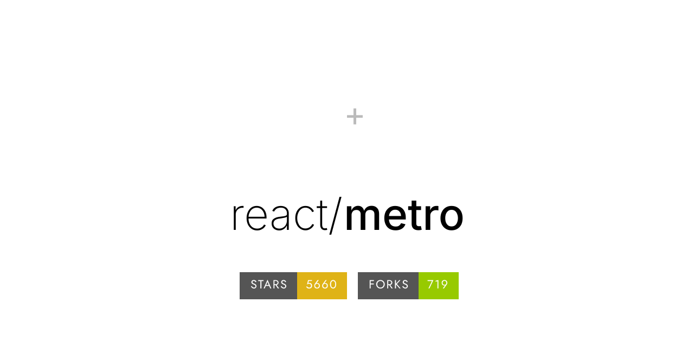</a></td>
<td align="center">1</td>
<td><a href="https://github.com/react/metro/pull/2278">Keep side effects in sequence operands when folding constants</a> in Meta's React Native bundler</td>
</tr>
<tr>
<td align="center"><a href="https://github.com/trpc/trpc/pulls?q=is%3Apr+author%3Aburrows99+is%3Amerged">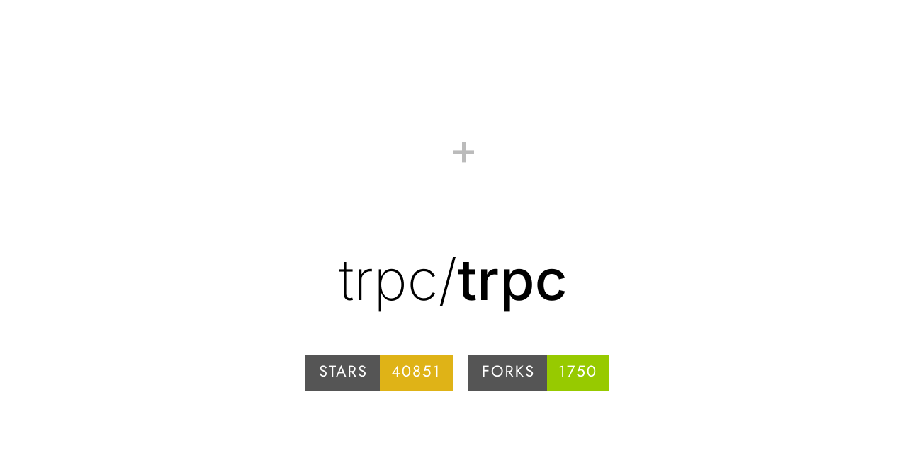</a></td>
<td align="center">2</td>
<td>OpenAPI: <a href="https://github.com/trpc/trpc/pull/8153">list <code>null</code> in the enum of a nullable literal union</a> · <a href="https://github.com/trpc/trpc/pull/8154">drop union members a bare sibling type already covers</a></td>
</tr>
<tr>
<td align="center"></td>
<td align="center">1</td>
<td><a href="https://github.com/NVIDIA/cuda-quantum/pull/5935">Let <code>cudaq.logical.measure</code> trace in a logical program</a></td>
</tr>
<tr>
<td align="center"></td>
<td align="center">1</td>
<td><a href="https://github.com/llm-d/llm-d-router/pull/4271">EPP accepts <code>prompt_embeds</code> completions requests</a></td>
</tr>
<tr>
<td align="center"></td>
<td align="center">1</td>
<td><a href="https://github.com/google/adk-go/pull/2332">Redact and bound code-part labels in agent analytics</a></td>
</tr>
<tr>
<td align="center"><a href="https://github.com/n8n-io/n8n/pulls?q=is%3Apr+author%3Aburrows99+is%3Amerged">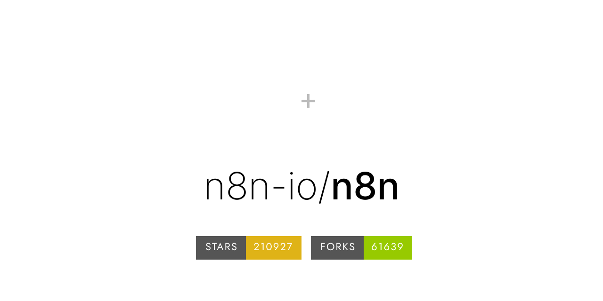</a></td>
<td align="center">2</td>
<td><a href="https://github.com/n8n-io/n8n/pull/43943">Discord node keeps the original error</a> · <a href="https://github.com/n8n-io/n8n/pull/43948">Singular text in the stop-executions toast for one execution</a></td>
</tr>
<tr>
<td align="center"><a href="https://github.com/twentyhq/twenty/pulls?q=is%3Apr+author%3Aburrows99+is%3Amerged">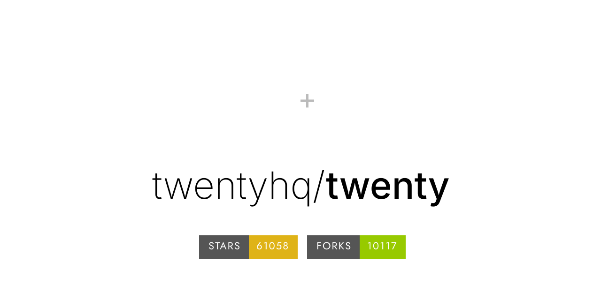</a></td>
<td align="center">1</td>
<td><a href="https://github.com/twentyhq/twenty/pull/30462">API key expiry label in the last 24 hours</a></td>
</tr>
<tr>
<td align="center"><a href="https://github.com/gpustack/gpustack/pulls?q=is%3Apr+author%3Aburrows99+is%3Amerged">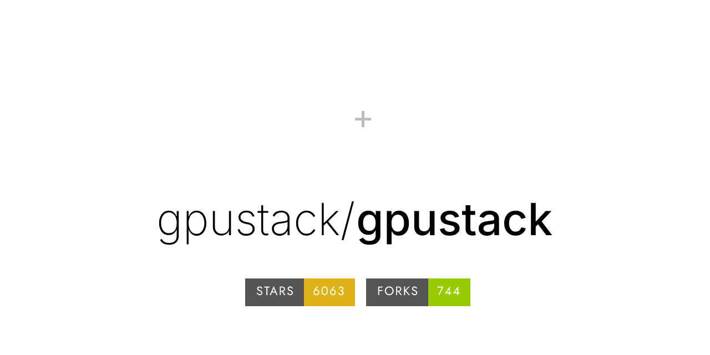</a></td>
<td align="center">1</td>
<td><a href="https://github.com/gpustack/gpustack/pull/6795">Reconnected worker keeps its tunnel route</a></td>
</tr>
<tr>
<td align="center"></td>
<td align="center">2</td>
<td><a href="https://github.com/aaif-goose/goose/pull/13563">Ollama XML tool calls keep <code>&lt;think&gt;</code> tags</a> · <a href="https://github.com/aaif-goose/goose/pull/13607">Desktop rejects non-image attachments on an external backend</a></td>
</tr>
<tr>
<td align="center"><a href="https://github.com/marimo-team/marimo/pulls?q=is%3Apr+author%3Aburrows99+is%3Amerged">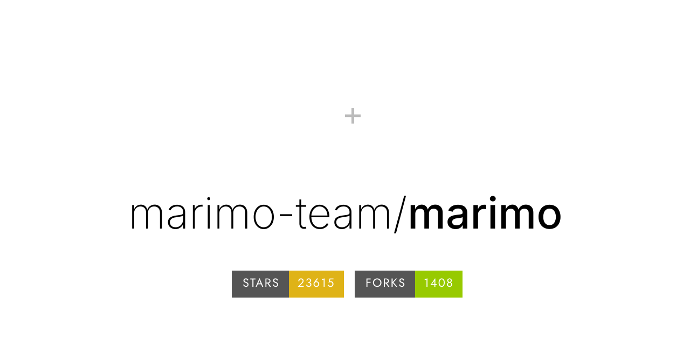</a></td>
<td align="center">2</td>
<td><a href="https://github.com/marimo-team/marimo/pull/11895">Variables search stops matching internal cell IDs</a> · <a href="https://github.com/marimo-team/marimo/pull/11897">Data sources search ignores surrounding whitespace</a></td>
</tr>
<tr>
<td align="center"></td>
<td align="center">2</td>
<td><a href="https://github.com/PrefectHQ/prefect/pull/24046">Escape no longer opens the flow run graph in fullscreen</a> · <a href="https://github.com/PrefectHQ/prefect/pull/24045">Tag groups with short tags show every tag inline</a></td>
</tr>
<tr>
<td align="center"><a href="https://github.com/remix-run/react-router/pulls?q=is%3Apr+author%3Aburrows99+is%3Amerged">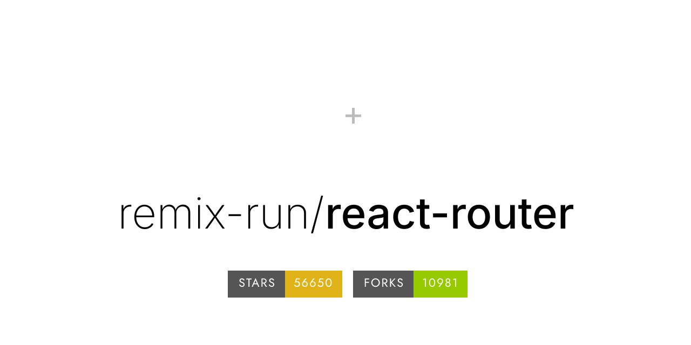</a></td>
<td align="center">1</td>
<td><a href="https://github.com/remix-run/react-router/pull/15815">Let the browser handle clicks on <code>&lt;Link download&gt;</code></a></td>
</tr>
<tr>
<td align="center"><a href="https://github.com/Arize-ai/phoenix/pulls?q=is%3Apr+author%3Aburrows99+is%3Amerged">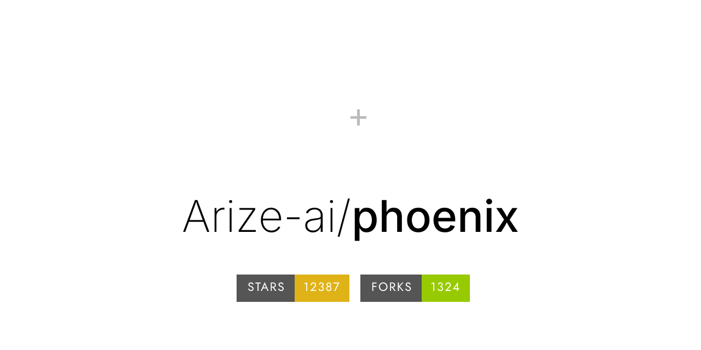</a></td>
<td align="center">1</td>
<td><a href="https://github.com/Arize-ai/phoenix/pull/17971">Round costs from $100 up to $10,000 to cents</a></td>
</tr>
<tr>
<td align="center"></td>
<td align="center">1</td>
<td><a href="https://github.com/amannn/next-intl/pull/2538">Leave <code>localeCookie</code> flags set to <code>false</code> out of the client-side cookie</a></td>
</tr>
<tr>
<td align="center"><a href="https://github.com/github/github-mcp-server/pulls?q=is%3Apr+author%3Aburrows99+is%3Amerged">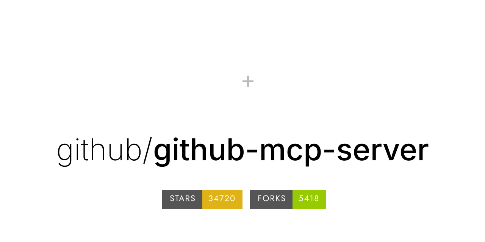</a></td>
<td align="center">1</td>
<td><a href="https://github.com/github/github-mcp-server/pull/3937">Accept the Swift ecosystem in <code>list_global_security_advisories</code></a>, approved by a maintainer</td>
</tr>
<tr>
<td align="center"></td>
<td align="center">1</td>
<td><a href="https://github.com/contextforge-org/contextforge-web-ui/pull/253">Translated role labels in the manage-members picker</a></td>
</tr>
<tr>
<td align="center"></td>
<td align="center">1</td>
<td><a href="https://github.com/awslabs/stickler/pull/582">Set a tolerance, not a threshold, in NumericComparator amount examples</a></td>
</tr>
<tr>
<td align="center"><a href="https://github.com/recharts/recharts/pulls?q=is%3Apr+author%3Aburrows99+is%3Amerged">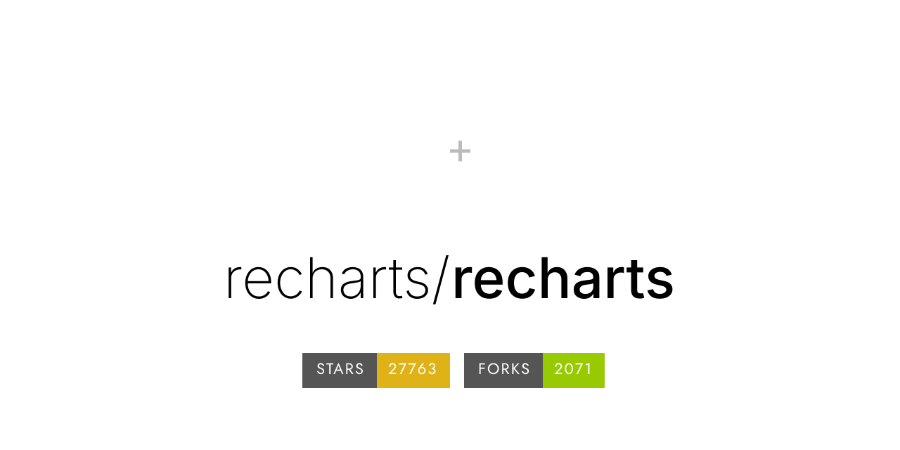</a></td>
<td align="center">2</td>
<td>Brush: <a href="https://github.com/recharts/recharts/pull/8291">move the right traveller with the keyboard after the travellers cross</a> · <a href="https://github.com/recharts/recharts/pull/8292">move the travellers by <code>gap</code> with the keyboard</a></td>
</tr>
<tr>
<td align="center"><a href="https://github.com/Tencent/WeKnora/pulls?q=is%3Apr+author%3Aburrows99+is%3Amerged">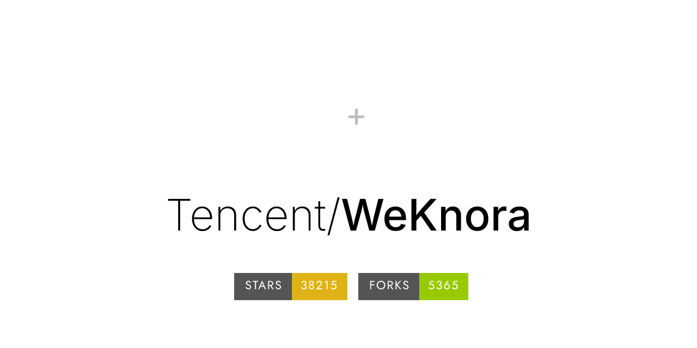</a></td>
<td align="center">1</td>
<td>Tencent's RAG framework: <a href="https://github.com/Tencent/WeKnora/pull/5531">send grayscale and palette images to the VLM as RGB</a></td>
</tr>
<tr><td colspan="3" align="center"><b>🔍 Open and in review</b></td></tr>
<tr>
<td align="center"><a href="https://github.com/meta/lexical/pulls?q=is%3Apr+author%3Aburrows99+is%3Aopen">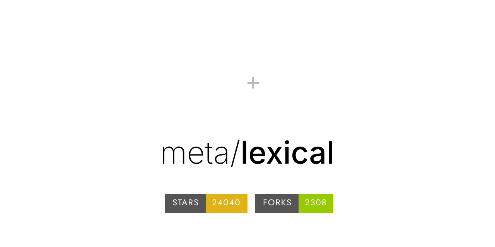</a></td>
<td align="center">4 open</td>
<td>Meta's editor: <a href="https://github.com/meta/lexical/pull/9966">floating toolbar is a clickable row after a block drag</a> · <a href="https://github.com/meta/lexical/pull/9967">Enter in an emptied font-size input no longer sets the minimum size</a> · <a href="https://github.com/meta/lexical/pull/9968">arrow, Home and End keys stay in an input inside a roving toolbar</a> · <a href="https://github.com/meta/lexical/pull/9969">selection font size shows again after leaving an emptied input</a></td>
</tr>
<tr>
<td align="center"></td>
<td align="center">3 open</td>
<td><a href="https://github.com/react/metro/pull/2279">Keep hoisted <code>var</code> declarations when folding away a branch</a> · <a href="https://github.com/react/metro/pull/2280">Treat optional chains, logical assignments and defaults as branches in inline requires</a> · <a href="https://github.com/react/metro/pull/2281">Don't copy <code>__esModule</code> in <code>export * from</code></a></td>
</tr>
<tr>
<td align="center"><a href="https://github.com/facebookresearch/faiss/pulls?q=is%3Apr+author%3Aburrows99+is%3Aopen">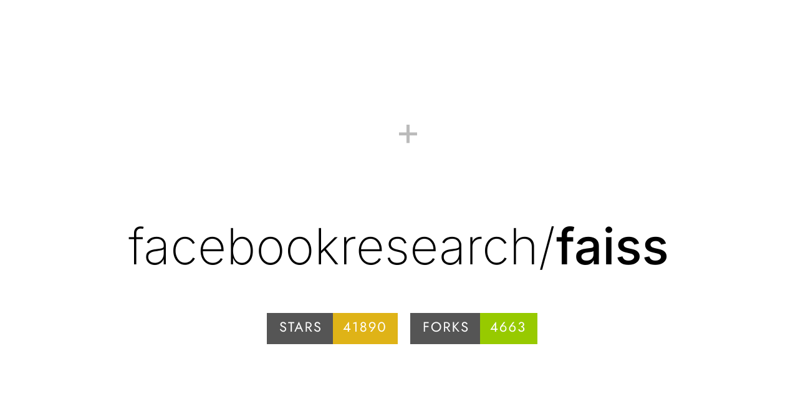</a></td>
<td align="center">open</td>
<td><a href="https://github.com/facebookresearch/faiss/pull/5972">Keep the ids array alive in <code>add_preassigned</code></a></td>
</tr>
<tr>
<td align="center"><a href="https://github.com/vercel/next.js/pulls?q=is%3Apr+author%3Aburrows99+is%3Aopen">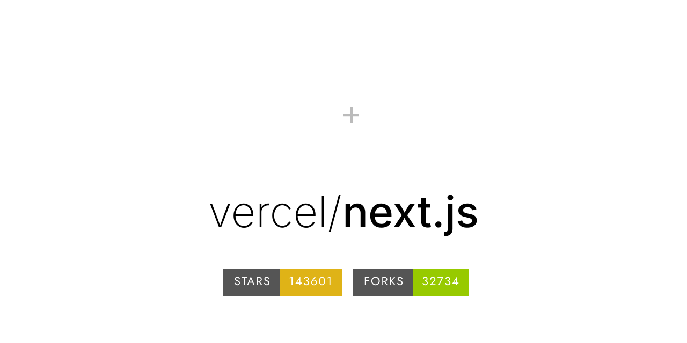</a></td>
<td align="center">open</td>
<td><a href="https://github.com/vercel/next.js/pull/102242">Preload the Node.js proxy with the other entries on start</a></td>
</tr>
<tr>
<td align="center"></td>
<td align="center">open</td>
<td><a href="https://github.com/kedacore/keda/pull/8385">Metrics API scaler honours <code>!=</code>, <code>=~</code> and <code>!~</code> label matchers</a>, after a maintainer assigned the issue · approved</td>
</tr>
<tr>
<td align="center"></td>
<td align="center">open</td>
<td><a href="https://github.com/grafana/grafana/pull/137891">Stop escaping playlist names in the delete confirmation and button labels</a> · approved</td>
</tr>
<tr>
<td align="center"></td>
<td align="center">2 open</td>
<td><a href="https://github.com/marimo-team/marimo/pull/12029">Update the <code>max_length</code> counter of text and text_area while typing</a> · <a href="https://github.com/marimo-team/marimo/pull/12030">Show an invalid email or URL input with the default debounce</a></td>
</tr>
<tr>
<td align="center"><a href="https://github.com/mlflow/mlflow/pulls?q=is%3Apr+author%3Aburrows99+is%3Aopen">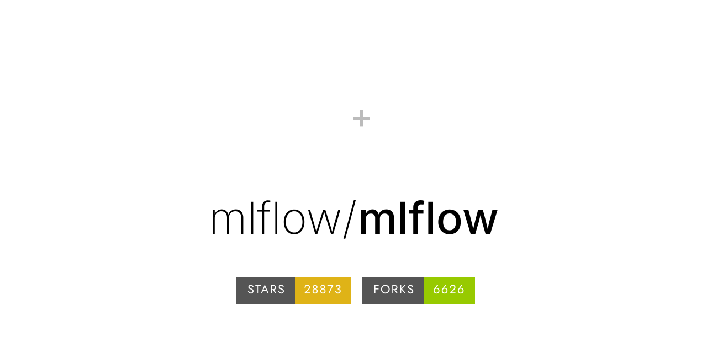</a></td>
<td align="center">open</td>
<td><a href="https://github.com/mlflow/mlflow/pull/27792">Run-root <code>runs:/&lt;run_id&gt;</code> URIs in artifact download and list</a></td>
</tr>
<tr>
<td align="center"><a href="https://github.com/PostHog/posthog/pulls?q=is%3Apr+author%3Aburrows99+is%3Aopen">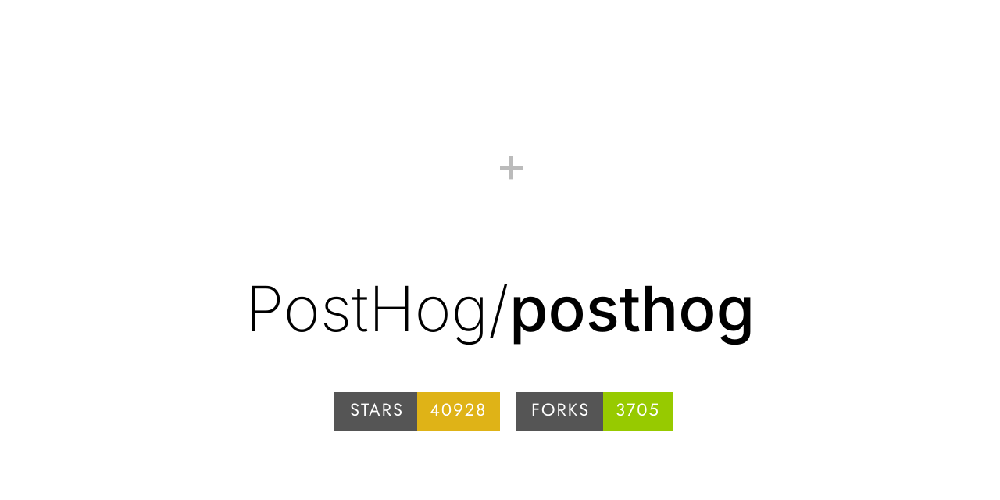</a></td>
<td align="center">open</td>
<td><a href="https://github.com/PostHog/posthog/pull/136134">Picking 12 in the morning selects midnight</a></td>
</tr>
<tr>
<td align="center"><a href="https://github.com/supabase/supabase/pulls?q=is%3Apr+author%3Aburrows99+is%3Aopen">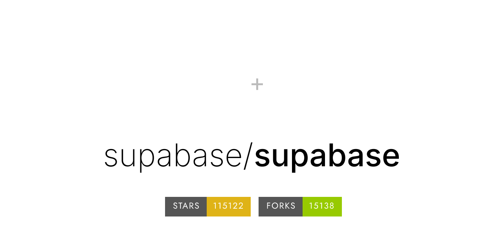</a></td>
<td align="center">2 open</td>
<td><a href="https://github.com/supabase/supabase/pull/53417">Case-insensitive database list search in Studio</a> · <a href="https://github.com/supabase/supabase/pull/53809">Trim spaces around values in the In list filter</a></td>
</tr>
<tr>
<td align="center"><a href="https://github.com/vllm-project/semantic-router/pulls?q=is%3Apr+author%3Aburrows99+is%3Aopen">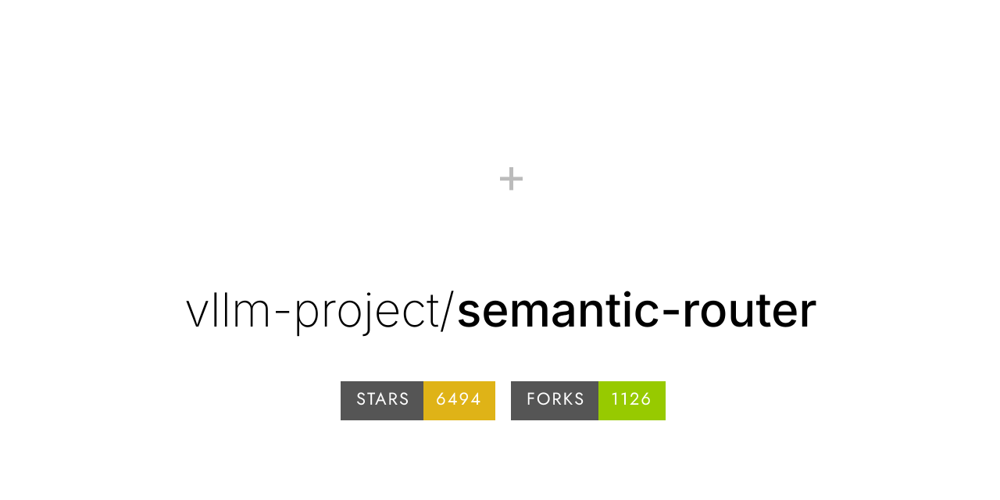</a></td>
<td align="center">open</td>
<td><a href="https://github.com/vllm-project/semantic-router/pull/6848">Apply the Operator startup probe's initialDelaySeconds</a></td>
</tr>
<tr>
<td align="center"><a href="https://github.com/QwenLM/qwen-code/pulls?q=is%3Apr+author%3Aburrows99+is%3Aopen">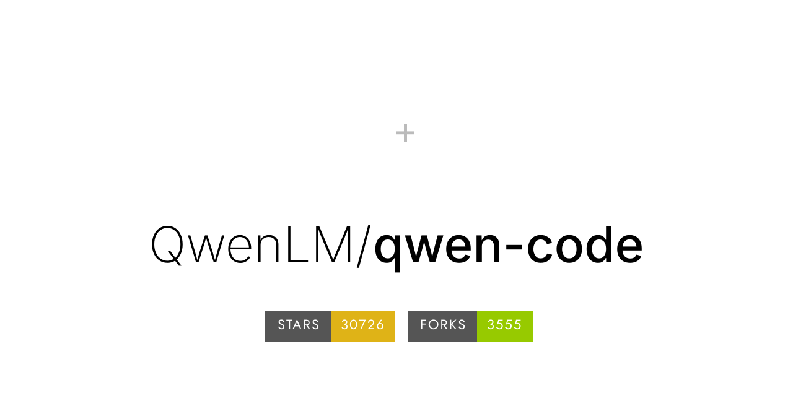</a></td>
<td align="center">2 open</td>
<td><a href="https://github.com/QwenLM/qwen-code/pull/17461">Mask secrets nested in a /config parent key value</a> · <a href="https://github.com/QwenLM/qwen-code/pull/17385">Skip tool-call-only turns when counting <code>/copy N</code></a></td>
</tr>
<tr>
<td align="center"></td>
<td align="center">open</td>
<td><a href="https://github.com/NVIDIA/warp/pull/2339">Hash captured constants at full precision</a></td>
</tr>
<tr>
<td align="center"><a href="https://github.com/google/adk-python/pulls?q=is%3Apr+author%3Aburrows99+is%3Aopen">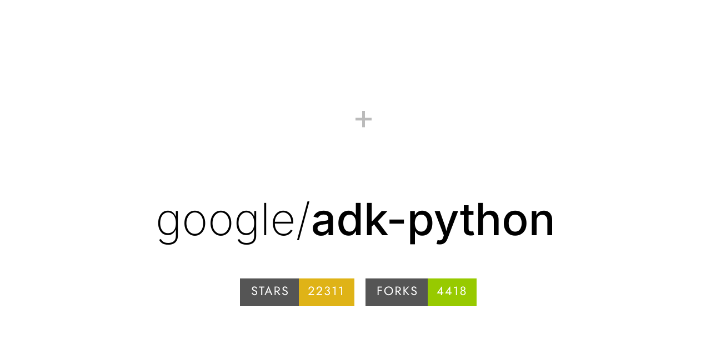</a></td>
<td align="center">2 open</td>
<td><a href="https://github.com/google/adk-python/pull/8245">Answer a failed task delegation with the error</a> · <a href="https://github.com/google/adk-python/pull/8246">Keep same-turn task delegations to one remote agent apart</a></td>
</tr>
<tr>
<td align="center"><a href="https://github.com/kafbat/kafka-ui/pulls?q=is%3Apr+author%3Aburrows99+is%3Aopen">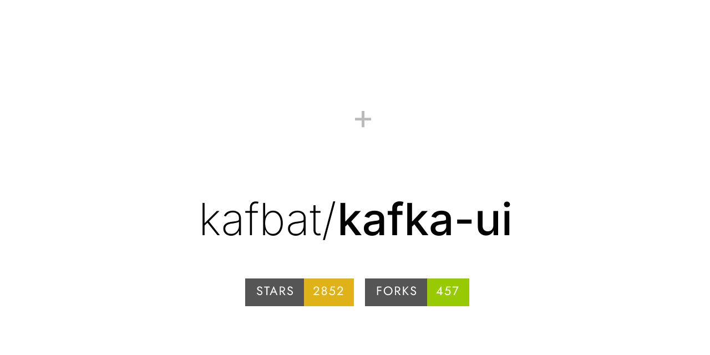</a></td>
<td align="center">open</td>
<td><a href="https://github.com/kafbat/kafka-ui/pull/2101">A failing preview JSON path no longer crashes the Messages page</a></td>
</tr>
<tr>
<td align="center"><a href="https://github.com/Aiven-Open/karapace/pulls?q=is%3Apr+author%3Aburrows99+is%3Aopen">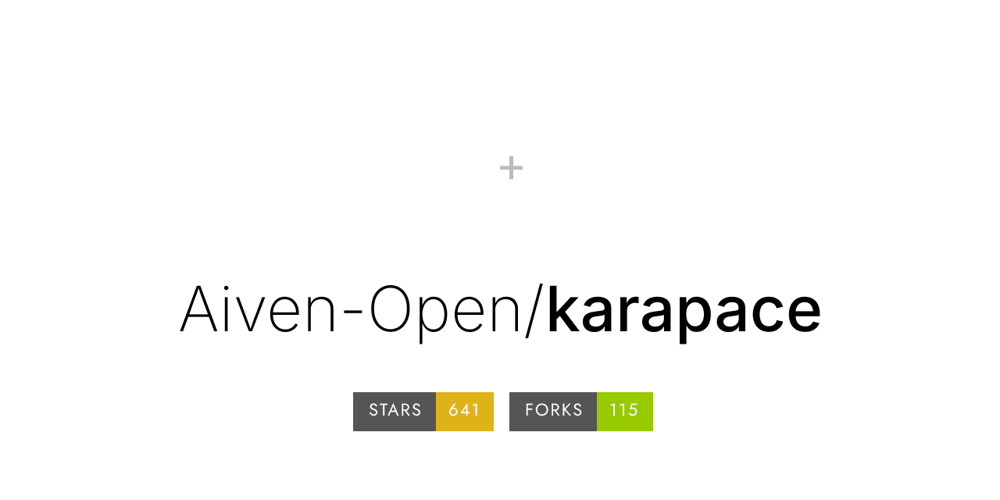</a></td>
<td align="center">open</td>
<td><a href="https://github.com/Aiven-Open/karapace/pull/1412">Resolve protobuf references for <code>GET /schemas/ids/{id}?format=serialized</code></a></td>
</tr>
<tr>
<td align="center"><b>38 more projects</b></td>
<td align="center">60 open</td>
<td>Planner MCP <a href="https://github.com/aixolotl/microsoft-planner-mcp/pull/56">#56</a>, <a href="https://github.com/aixolotl/microsoft-planner-mcp/pull/58">#58</a>, <a href="https://github.com/aixolotl/microsoft-planner-mcp/pull/60">#60</a>, <a href="https://github.com/aixolotl/microsoft-planner-mcp/pull/62">#62</a>, <a href="https://github.com/aixolotl/microsoft-planner-mcp/pull/64">#64</a>, <a href="https://github.com/aixolotl/microsoft-planner-mcp/pull/66">#66</a>, <a href="https://github.com/aixolotl/microsoft-planner-mcp/pull/68">#68</a> · Mattermost <a href="https://github.com/mattermost/mattermost/pull/40050">#40050</a>, <a href="https://github.com/mattermost/mattermost/pull/40051">#40051</a>, <a href="https://github.com/mattermost/mattermost/pull/40052">#40052</a> · NocoDB <a href="https://github.com/nocodb/nocodb/pull/15046">#15046</a>, <a href="https://github.com/nocodb/nocodb/pull/15047">#15047</a>, <a href="https://github.com/nocodb/nocodb/pull/15048">#15048</a> · AgentKit <a href="https://github.com/coinbase/agentkit/pull/1675">#1675</a>, <a href="https://github.com/coinbase/agentkit/pull/1676">#1676</a> · CUDA-Q <a href="https://github.com/NVIDIA/cuda-quantum/pull/5977">#5977</a>, <a href="https://github.com/NVIDIA/cuda-quantum/pull/5978">#5978</a> · deepagentsjs <a href="https://github.com/langchain-ai/deepagentsjs/pull/951">#951</a>, <a href="https://github.com/langchain-ai/deepagentsjs/pull/1101">#1101</a> · DeerFlow <a href="https://github.com/bytedance/deer-flow/pull/8282">#8282</a>, <a href="https://github.com/bytedance/deer-flow/pull/8288">#8288</a> · Greplica <a href="https://github.com/Autoloops/greplica/pull/108">#108</a>, <a href="https://github.com/Autoloops/greplica/pull/109">#109</a> · HF Chat UI <a href="https://github.com/huggingface/chat-ui/pull/2770">#2770</a>, <a href="https://github.com/huggingface/chat-ui/pull/2771">#2771</a> · Jupyter Chat <a href="https://github.com/jupyterlab/jupyter-chat/pull/587">#587</a>, <a href="https://github.com/jupyterlab/jupyter-chat/pull/589">#589</a> · LiteSVM <a href="https://github.com/LiteSVM/litesvm/pull/459">#459</a>, <a href="https://github.com/LiteSVM/litesvm/pull/460">#460</a> · Mantine <a href="https://github.com/mantinedev/mantine/pull/9482">#9482</a>, <a href="https://github.com/mantinedev/mantine/pull/9483">#9483</a> · MCP Toolbox <a href="https://github.com/googleapis/mcp-toolbox/pull/4585">#4585</a>, <a href="https://github.com/googleapis/mcp-toolbox/pull/4586">#4586</a> · MetaMask Mobile <a href="https://github.com/MetaMask/metamask-mobile/pull/40366">#40366</a>, <a href="https://github.com/MetaMask/metamask-mobile/pull/40367">#40367</a> · n8n <a href="https://github.com/n8n-io/n8n/pull/43942">#43942</a>, <a href="https://github.com/n8n-io/n8n/pull/43944">#43944</a> · ADK Web <a href="https://github.com/google/adk-web/pull/566">#566</a> · AgentScope <a href="https://github.com/agentscope-ai/agentscope/pull/4074">#4074</a> · AI Elements <a href="https://github.com/vercel/ai-elements/pull/517">#517</a> · Anchor <a href="https://github.com/otter-sec/anchor/pull/5357">#5357</a> · AWS Labs social messaging toolkit <a href="https://github.com/awslabs/social-messaging-agent-runtime-toolkit/pull/199">#199</a> · AWS MCP <a href="https://github.com/awslabs/mcp/pull/5169">#5169</a> · CopilotKit <a href="https://github.com/CopilotKit/CopilotKit/pull/8403">#8403</a> · Excalidraw <a href="https://github.com/excalidraw/excalidraw/pull/12628">#12628</a> · GitHub MCP server <a href="https://github.com/github/github-mcp-server/pull/3936">#3936</a> · GPUStack <a href="https://github.com/gpustack/gpustack/pull/6796">#6796</a> · Hoppscotch <a href="https://github.com/hoppscotch/hoppscotch/pull/6796">#6796</a> · Karmada <a href="https://github.com/karmada-io/karmada/pull/8065">#8065</a> · Langflow <a href="https://github.com/langflow-ai/langflow/pull/16430">#16430</a> · LiteLLM <a href="https://github.com/BerriAI/litellm/pull/51951">#51951</a> · LiveKit Agents Playground <a href="https://github.com/livekit/agents-playground/pull/224">#224</a> · MCP C# SDK <a href="https://github.com/modelcontextprotocol/csharp-sdk/pull/1922">#1922</a> · Ollama <a href="https://github.com/ollama/ollama/pull/19707">#19707</a> · OpenHands <a href="https://github.com/OpenHands/OpenHands/pull/19757">#19757</a> · Payload <a href="https://github.com/payloadcms/payload/pull/19603">#19603</a> · Pipecat <a href="https://github.com/pipecat-ai/pipecat/pull/6945">#6945</a> · Plane <a href="https://github.com/makeplane/plane/pull/10287">#10287</a> · Qdrant Web UI <a href="https://github.com/qdrant/qdrant-web-ui/pull/487">#487</a> · Temporal TS SDK <a href="https://github.com/temporalio/sdk-typescript/pull/2695">#2695</a></td>
</tr>
<tr><td colspan="3" align="center"><b>🕰️ Earlier</b></td></tr>
<tr>
<td align="center"></td>
<td align="center">1</td>
<td><a href="https://github.com/StackOneHQ/defender/pull/47">Prevent prototype pollution during object traversal</a></td>
</tr>
<tr>
<td align="center"><a href="https://github.com/aixolotl/microsoft-planner-mcp/pulls?q=is%3Apr+author%3Aburrows99">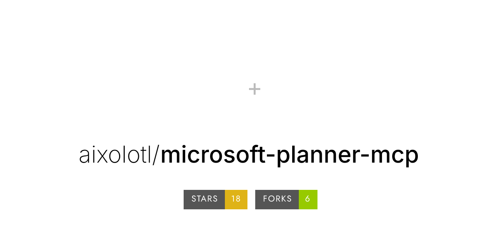</a></td>
<td align="center">6</td>
<td>Built the FastMCP server, on-behalf-of auth and the Planner service layer</td>
</tr>
<tr>
<td align="center"></td>
<td align="center">1</td>
<td><a href="https://github.com/syntasso/kratix/pull/662">Contributor-docs fix</a></td>
</tr>
<tr>
<td align="center"><a href="https://github.com/microsoft/DebugMCP/issues?q=is%3Aissue+author%3Aburrows99">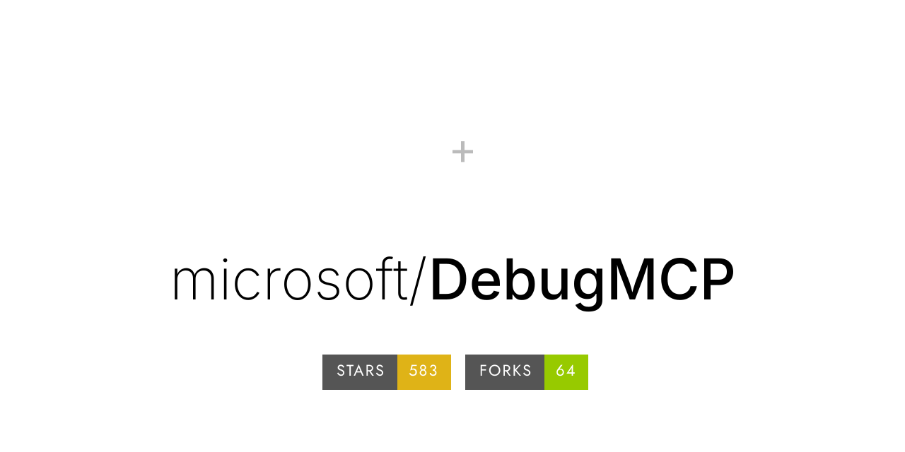</a></td>
<td align="center">issue</td>
<td><a href="https://github.com/microsoft/DebugMCP/issues/91">Reported the README/CHANGELOG link to the debug skill</a>, since fixed</td>
</tr>
<tr>
<td align="center"><a href="https://github.com/langchain-ai/retrieval-agent-template/pulls?q=is%3Apr+author%3Aburrows99">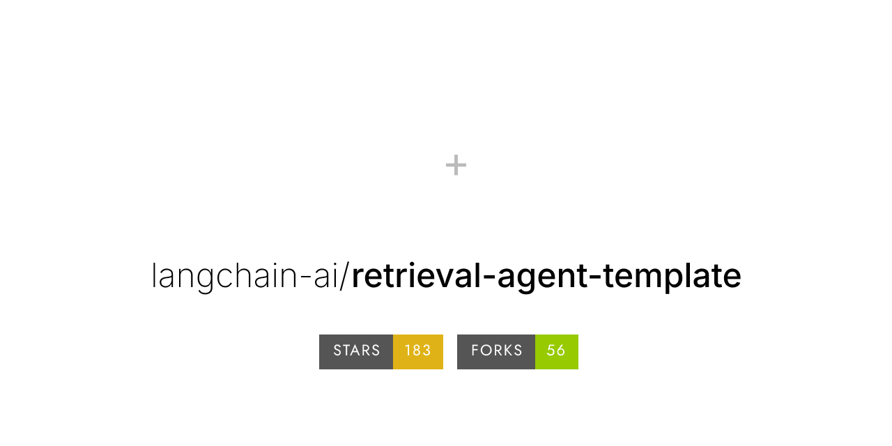</a></td>
<td align="center">open</td>
<td><a href="https://github.com/langchain-ai/retrieval-agent-template/pull/12">Ollama and Elasticsearch integration</a></td>
</tr>
</table>

---

### 🏅 Recognition & education

<table>
<tr>
<td width="50%" valign="top">

**🏆 Recognition**

- 📖 **Technical Reviewer** of [*3D Web Development with Three.js & Next.js*](https://bpbonline.com/products/3d-web-development-with-three-js-and-next-js?variant=44713720709320) (BPB Publications, 2025): chapters 17–18 on performance optimisation and AWS Amplify · [post](https://www.linkedin.com/feed/update/urn:li:activity:7357424138774372352/)
- 🥈 **2nd place, office hackathon** at QuestionPro: a RAG knowledge chatbot with vector embeddings that cut false positives by **~40%** · [mention](https://www.linkedin.com/feed/update/urn:li:activity:7061599326224924672/)

</td>
<td width="50%" valign="top">

**🎓 Education**

- **MSc Artificial Intelligence**, [University of Surrey](https://www.surrey.ac.uk/) (2025–26), Merit. Dissertation with Distinction: a Supervisor/Worker [Mixture-of-Agents](https://github.com/burrows99/nhs-triage-simulation) in LangGraph that cut NHS doctor wait times by **58%** and raised resource utilisation by **19%**
- **BTech Computer Science and Engineering**, [Jaypee University of Information Technology](https://www.juit.ac.in/) (2017–21)

</td>
</tr>
</table>

---

### 🧰 My stack

  

<!-- AI / LLM ecosystem (skillicons has no icons for these — using shields + simple-icons) -->

  
  
  
  
  
  
  

---

### 📊 By the numbers

<!-- Live: totals pulled from the GitHub Search API on every render (no Action, no token). Public commits/PRs/issues only -->

  
  
  
  

<table align="center">
<tr>
<td valign="top"></td>
<td valign="top"></td>
</tr>
</table>

<!-- Contribution history (line/area graph) -->

<table align="center">
<tr>
<td valign="top"></td>
<td valign="top"></td>
</tr>
</table>

<!-- Snake animation eating the contribution grid (auto-built by the Platane/snk Action) -->

  <picture>
    <source media="(prefers-color-scheme: dark)" srcset="https://raw.githubusercontent.com/burrows99/burrows99/output/github-contribution-grid-snake-dark.svg" />
    
  </picture>

